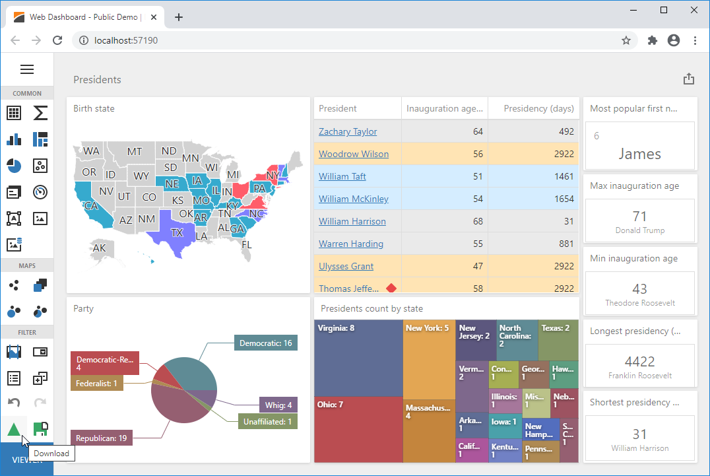

<!-- default file list -->
*Files to look at*:

* [SessionDashboardStorage.cs](./CS/App_Code/SessionDashboardStorage.cs)
* [downloadAndSaveAsExtension.js](./CS/Content/downloadAndSaveAsExtension.js) 
* [scripts.js](./CS/Content/scripts.js)
* [HomeController.cs](./CS/Controllers/HomeController.cs)
* [Global.asax.cs](./CS/Global.asax.cs)
* [Index.cshtml](./CS/Views/Home/Index.cshtml)
<!-- default file list end -->
# ASP.NET MVC Dashboard Designer - How to enable users to download a dashboard XML definition

The example shows how to allow end users to save a dashboard to a [session](https://docs.microsoft.com/en-us/dotnet/api/system.web.sessionstate.httpsessionstate) and download a dashboard XML definition on the client side. For this, use the corresponding **Download** and **Save As...** buttons in the [Toolbox](https://docs.devexpress.com/Dashboard/117442/web-dashboard/ui-elements/toolbox).

